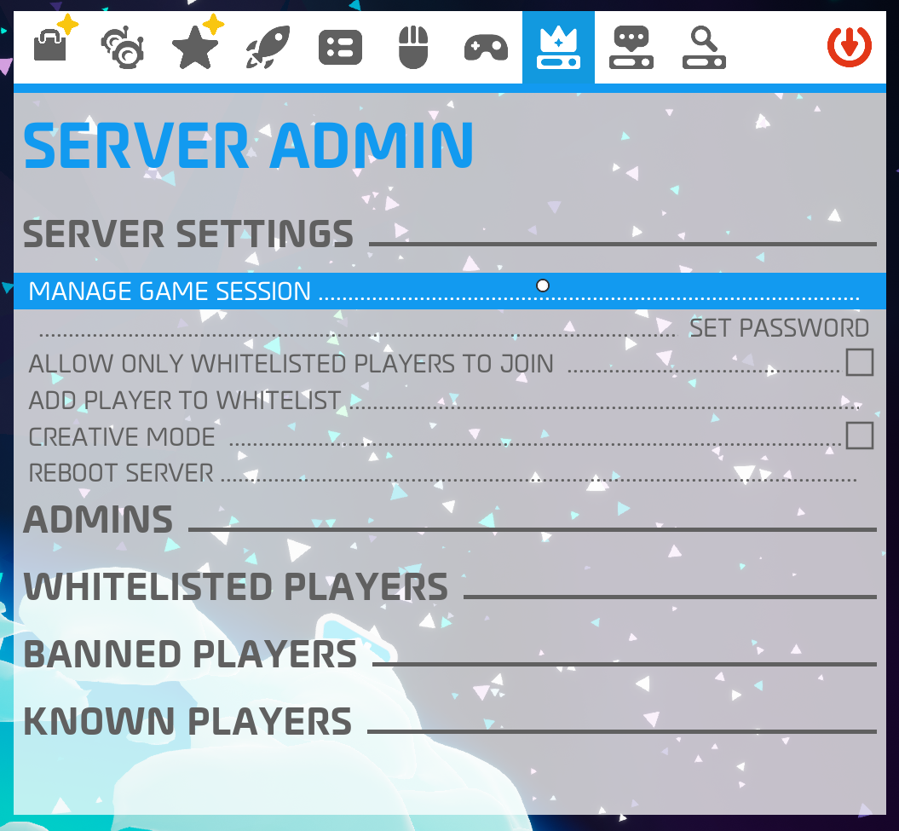
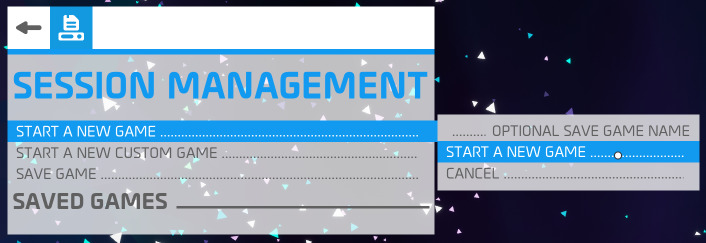

# Astroneer Dedicated Server (in a container)

[](https://hub.docker.com/r/whalybird/astroneer-server)
[](https://hub.docker.com/r/whalybird/astroneer-server)

A docker image to run Astroneer Dedicated Server using [AstroTuxLauncher](https://github.com/JoeJoeTV/AstroTuxLauncher). The source code is [available on GitHub](https://github.com/C0Nd3Mnd/astroneer-docker/).

## Compose

```yaml
services:
  astroneer:
    image: whalybird/astroneer-server:latest
    restart: unless-stopped
    stdin_open: true
    tty: true
    ports:
      - 7777:7777/udp
    volumes:
      - ./saved:/astrotux/AstroneerServer/Astro/Saved
```

## Encryption support (experimental)

As of Wine 10.6 and GnuTLS 3.8.3, server encryption is supported. This container image now has an `experimental` tag that supports encryption and enables it by default. After some testing I'm planning to make this the default image (`latest` tag).

If you want to use encryption right now, change the `image` line in your `compose.yml` to `image: whalybird/astroneer-server:experimental`. Make sure to **remove** the `net.AllowEncryption=False` line from any client's `Engine.ini` (see [Configuring clients](#configuring-clients)).

You can also disable encryption on this `experimental` image by setting `DISABLE_ENCRYPTION=true` in your `compose.yml`.

## Interacting with the AstroTuxLauncher console

You can interact with the console by using `docker compose attach astroneer`. Detach using `CTRL+p` + `CTRL+q`, using `CTRL+c` will shutdown the server.

## Configuring clients

Because Wine doesn't support some of the encryption functionality Astroneer uses, running this container has encryption disabled by default. That means that game clients will only be able to connect if they have encryption disabled as well.

To disable encryption, you need to edit the file `Engine.ini` located in `%localappdata%\Astro\Saved\Config\WindowsNoEditor`. Make sure the game isn't running and add the following lines to the file:

```ini
[SystemSettings]
net.AllowEncryption=False
```

## Making yourself admin

shutdown the server (`docker compose stop`) and edit the file `AstroServerSetting.ini` located in `./saves/Config/WindowsServer`. Change the value of `OwnerName` to your Steam name and make sure `OwnerGuid` is set to `0`. It should look like this:

```ini
OwnerName=My Steam Username
OwnerGuid=0
```

Start the server and make sure you join it before anyone else, as the game will automatically assign the admin/owner role to the first player joining.

## If you can't progress past the first mission

If you can't progress past the first mission, you have to start a new game via the "Server admin" tab after connecting to the server. Click on "Manage game session" followed by "Start a new game" (and confirm by clicking "Start a new game" in the popout):

\
_Server admin > Manage game session_

\
_Start a new game > Start a new game_
